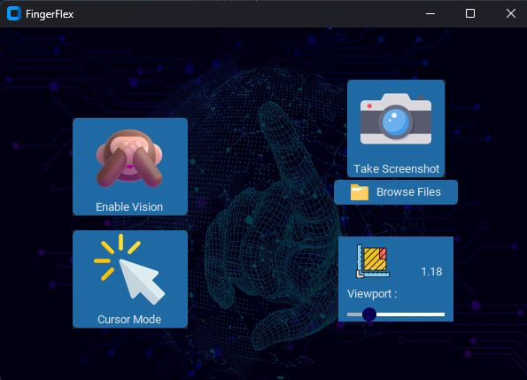
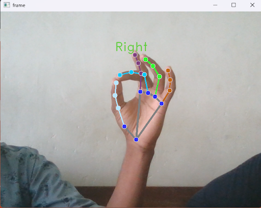
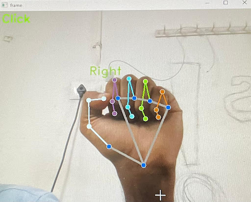
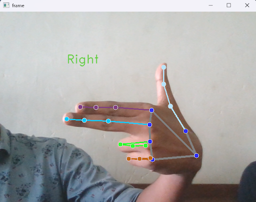

# FingerFlex - Computer Vision Gesture Control

FingerFlex is a project that harnesses the power of computer vision to detect and track the motion of your palm and other gestures, allowing you to seamlessly control various functions on your device. Whether you want to effortlessly move your cursor, navigate through slides, take screenshots, or trigger custom actions, FingerFlex empowers you to do it all with simple hand gestures.



## Features

- **Gesture Recognition:** FingerFlex uses advanced computer vision algorithms to accurately detect and track your hand movements, making gesture-based control intuitive and precise.

- **Customizable Gestures:** Define your own hand gestures and map them to specific functions on your device. Customize FingerFlex to suit your unique needs and workflow.

- **Multi-Mode Support:** Switch between different modes to control various applications or devices. FingerFlex adapts to your context, whether you're giving a presentation or navigating your computer.

- **Python CustomTkinter UI:** FingerFlex features a user-friendly interface built using Python's CustomTkinter library. This interface allows you to configure settings, define gestures, and switch between modes effortlessly.

## Supported Actions

FingerFlex can be configured to perform a wide range of actions, including but not limited to:

- **Cursor Movement:** Control your cursor's position and movement with the wave of your hand.

- **Click and Drag:** Make easy clicks by pinching thumb and index, and drag by moving your hand while pinching.

- **Next and Previous Slides:** Effortlessly navigate through presentation slides during your meetings or talks with gestures.

- **Take Screenshots:** Capture your screen with a simple hand gesture for easy documentation by holding up a closed fist.

- **Custom Actions:** Define your own actions and associate them with specific gestures. The possibilities are endless!

## Example Gestures

Here are three example gestures you can use with FingerFlex:

### 1. Pinch Gesture (Click)



To perform a click action, make a pinching motion with your thumb and index finger. This simulates a mouse click.

### 2. Closed Fist Gesture (Take Screenshots)



To take a screenshot, hold up a closed fist for a moment. FingerFlex will capture the screen when it detects this gesture.

### 3. Swipe Right Gesture (Next Slide)



During a presentation, swipe your hand to the right to navigate to the next slide. FingerFlex simplifies slide transitions with this gesture.

## Getting Started

Follow these steps to get started with FingerFlex:

1. Clone the FingerFlex repository to your local machine:

   ```bash
   git clone https://github.com/kevinjacb/fingerflex.git
   ```

2. Install the required dependencies by running:

   ```bash
   pip install -r requirements.txt
   ```

3. Launch FingerFlex by executing:

   ```bash
   python main.py
   ```

4. Use the intuitive user interface to configure gestures and modes to your liking.

## Configuration

FingerFlex is highly customizable. You can configure the following settings:

- **Gesture Definitions:** Define and train your gestures using the Gesture Editor in the user interface.

- **Action Mapping:** Map your gestures to specific actions on your device, such as cursor movement or taking screenshots.

- **Mode Selection:** Switch between different modes for different applications or scenarios such as presentation mode and normal mode.
